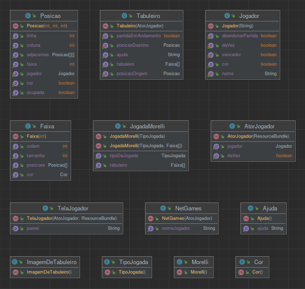
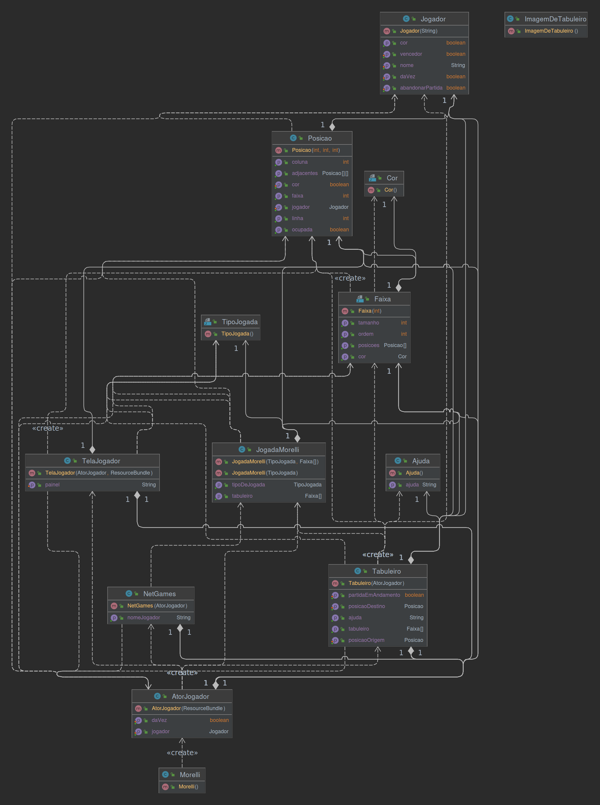
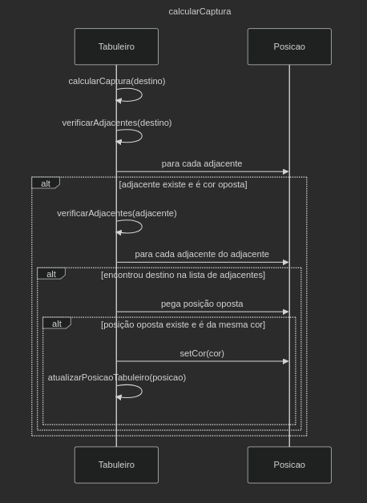
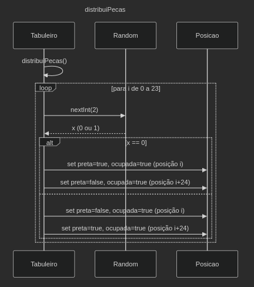
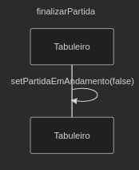
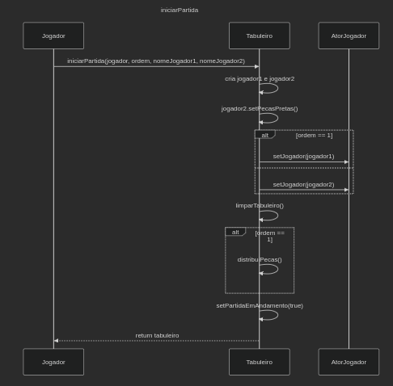
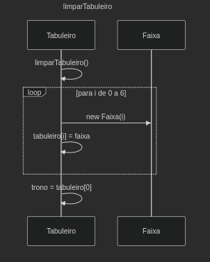
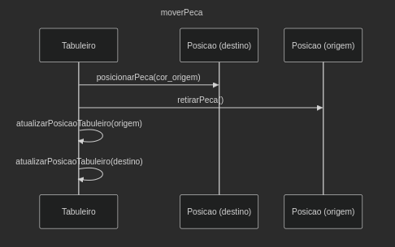
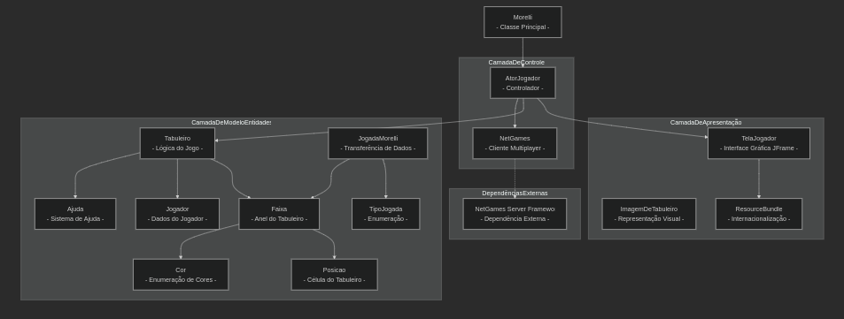

# 2.2.4 Modelagem e abstração

## 1. Produzir diagramas UML

### (a) Diagrama de classes com principais entidades;

    
Diagrama <strong>sem</strong> Dependencias
 

    

    
Diagrama <strong>com</strong> Dependencias
 

    

### (b) Diagrama de sequência para fluxos relevantes;

    
1. calcularCaptura()

    
2. distribuiPecas()

    
3. finalizarPartida()

    
4. iniciarPartida()

    
5. limparTabuleiro()

    
6. moverPeca()

### (c) Diagrama de componentes para arquitetura geral.

    
Diagrama Arquitetura
 

## 2. Abstração da Arquitetura Identificada

### (a) Camada de Apresentação
A camada de apresentação é responsável pela interface com o usuário e inclui:
- **`TelaJogador`**: Classe que estende JFrame e implementa a interface gráfica principal do jogo
- **`ResourceBundle`**: Responsável pela internacionalização (mensagens em português e inglês)
- **Recursos de imagem**: Elementos visuais utilizados na interface

Esta camada é passiva, apenas exibe informações e repassa as interações do usuário para o controlador (`AtorJogador`), sem conter qualquer lógica de negócio.

### (b) Camada de Negócio
A camada de negócio contém o núcleo da lógica do jogo e as entidades de domínio:
- **Tabuleiro**: Classe central que gerencia o estado do jogo, regras de movimento, capturas e conquista do trono
- **Entidades**: Faixa, Posicao, Jogador - representam os elementos fundamentais do domínio do problema
- **Regras de negócio**: Implementadas principalmente em Tabuleiro (`calcularMovimento`, `calcularCaptura`, `calcularTomadaTrono`)
- **Ajuda**: Contém as explicações das regras do jogo
- **Enums**: TipoJogada e Cor definem os tipos de ações e cores utilizadas no jogo

Esta camada deveria ser independente, mas sofre de uma violação arquitetural grave pois Tabuleiro possui dependência direta para `AtorJogador` (da camada de controle).

### (c) Camada de Persistência
**Esta camada é inexistente no sistema atual**. Não há qualquer mecanismo de persistência de dados implementado:
- Não há uso de banco de dados (não existem scripts SQL, entidades JPA ou configurações de conexão)
- Não há serialização de objetos para arquivos
- Não há uso de serviços web para armazenamento remoto
- Todo o estado do jogo é mantido em memória durante a execução e perdido quando o programa é finalizado

A ausência desta camada representa uma limitação significativa do sistema, impossibilitando a recuperação de partidas em andamento ou o registro histórico de jogos.