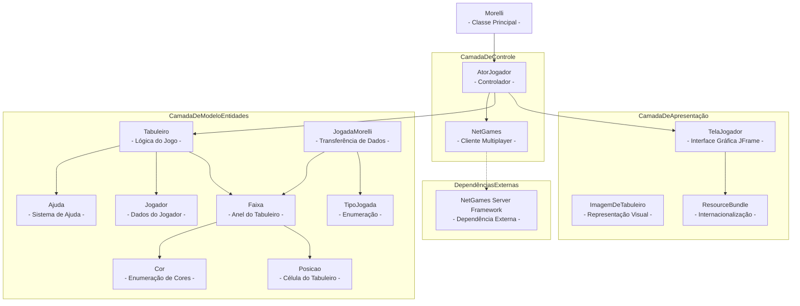

```mermaid
flowchart TD
    MORELLI[Morelli<br/>- Classe Principal -]
    ATORJOGADOR[AtorJogador<br/>- Controlador -]
    TELAJOGADOR[TelaJogador<br/>- Interface Gráfica JFrame -]
    
    TABULEIRO[Tabuleiro<br/>- Lógica do Jogo -]
    JOGADAMORELLI[JogadaMorelli<br/>- Transferência de Dados -]
    TIPOJOGADA[TipoJogada<br/>- Enumeração -]
    FAIXA[Faixa<br/>- Anel do Tabuleiro -]
    POSICAO[Posicao<br/>- Célula do Tabuleiro -]
    JOGADOR[Jogador<br/>- Dados do Jogador -]
    COR[Cor<br/>- Enumeração de Cores -]
    AJUDA[Ajuda<br/>- Sistema de Ajuda -]
    IMAGEM[ImagemDeTabuleiro<br/>- Representação Visual -]
    
    RESBUNDLE[ResourceBundle<br/>- Internacionalização -]
    NETGAMES[NetGames<br/>- Cliente Multiplayer -]
    NETGAMESFW[NetGames Server Framework<br/>- Dependência Externa -]
    
    MORELLI --> ATORJOGADOR
    ATORJOGADOR --> TELAJOGADOR
    ATORJOGADOR --> TABULEIRO
    ATORJOGADOR --> NETGAMES
    TELAJOGADOR --> RESBUNDLE
    
    TABULEIRO --> FAIXA
    FAIXA --> POSICAO
    TABULEIRO --> JOGADOR
    TABULEIRO --> AJUDA
    
    JOGADAMORELLI --> TIPOJOGADA
    JOGADAMORELLI --> FAIXA
    
    FAIXA --> COR
    
    NETGAMES -.-> NETGAMESFW
    
    subgraph CamadaDeApresentação
        TELAJOGADOR
        RESBUNDLE
        IMAGEM
    end
    
    subgraph CamadaDeControle
        ATORJOGADOR
        NETGAMES
    end
    
    subgraph CamadaDeModeloEntidades
        TABULEIRO
        JOGADAMORELLI
        TIPOJOGADA
        FAIXA
        POSICAO
        JOGADOR
        COR
        AJUDA
    end
    
    subgraph DependênciasExternas
        NETGAMESFW
    end
    
    class MORELLI,ATORJOGADOR,TELAJOGADOR main
    class TABULEIRO,JOGADAMORELLI,TIPOJOGADA,FAIXA,POSICAO,JOGADOR,COR,AJUDA,IMAGEM entity
    class RESBUNDLE,NETGAMES support
    class NETGAMESFW external
```