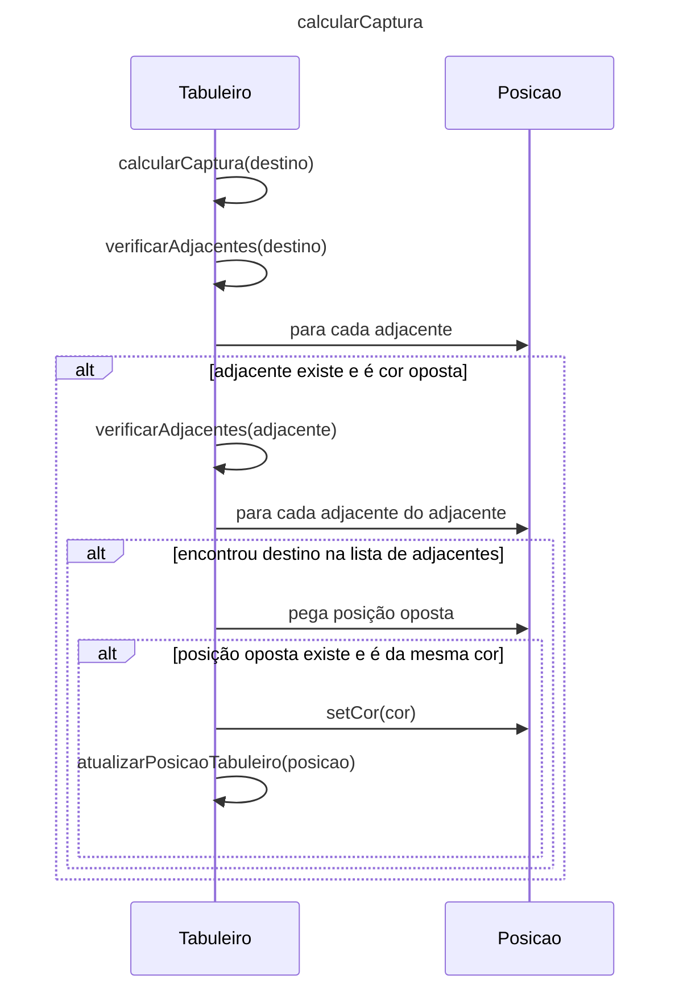

```mermaid
sequenceDiagram
    title calcularCaptura
    participant Tabuleiro
    participant Posicao
    Tabuleiro->>Tabuleiro: calcularCaptura(destino)
    Tabuleiro->>Tabuleiro: verificarAdjacentes(destino)
    Tabuleiro->>Posicao: para cada adjacente
    alt adjacente existe e é cor oposta
        Tabuleiro->>Tabuleiro: verificarAdjacentes(adjacente)
        Tabuleiro->>Posicao: para cada adjacente do adjacente
        alt encontrou destino na lista de adjacentes
            Tabuleiro->>Posicao: pega posição oposta
            alt posição oposta existe e é da mesma cor
                Tabuleiro->>Posicao: setCor(cor)
                Tabuleiro->>Tabuleiro: atualizarPosicaoTabuleiro(posicao)
            end
        end
    end
```