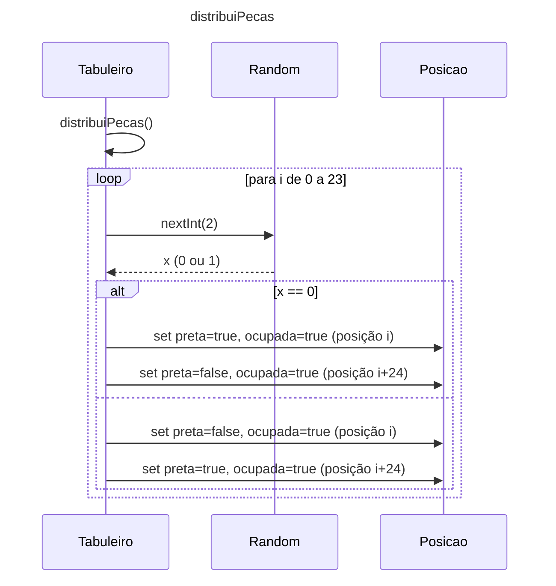

```mermaid
sequenceDiagram
    title distribuiPecas
    participant Tabuleiro
    participant Random
    Tabuleiro->>Tabuleiro: distribuiPecas()
    loop para i de 0 a 23
        Tabuleiro->>Random: nextInt(2)
        Random-->>Tabuleiro: x (0 ou 1)
        alt x == 0
            Tabuleiro->>Posicao: set preta=true, ocupada=true (posição i)
            Tabuleiro->>Posicao: set preta=false, ocupada=true (posição i+24)
        else
            Tabuleiro->>Posicao: set preta=false, ocupada=true (posição i)
            Tabuleiro->>Posicao: set preta=true, ocupada=true (posição i+24)
        end
    end
```