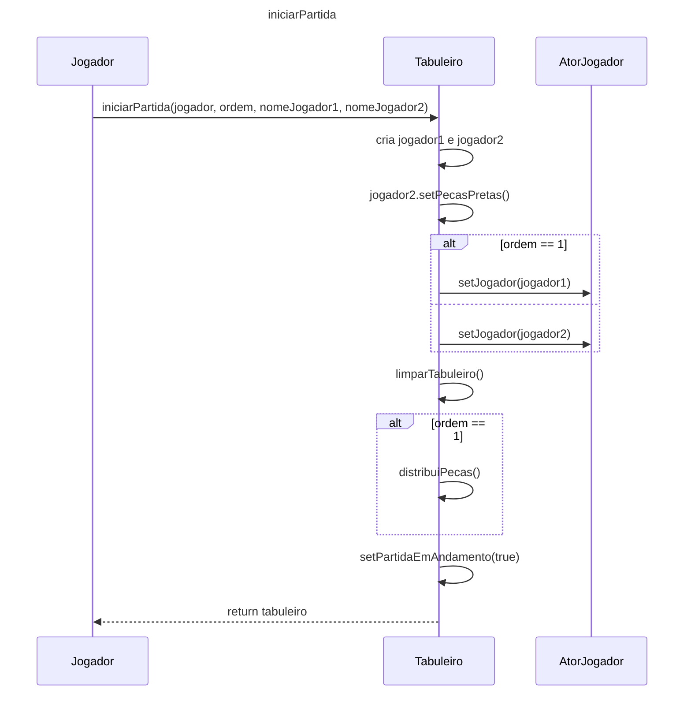

```mermaid
sequenceDiagram
    title iniciarPartida
    participant Jogador
    participant Tabuleiro
    participant AtorJogador
    Jogador->>Tabuleiro: iniciarPartida(jogador, ordem, nomeJogador1, nomeJogador2)
    Tabuleiro->>Tabuleiro: cria jogador1 e jogador2
    Tabuleiro->>Tabuleiro: jogador2.setPecasPretas()
    alt ordem == 1
        Tabuleiro->>AtorJogador: setJogador(jogador1)
    else
        Tabuleiro->>AtorJogador: setJogador(jogador2)
    end
    Tabuleiro->>Tabuleiro: limparTabuleiro()
    alt ordem == 1
        Tabuleiro->>Tabuleiro: distribuiPecas()
    end
    Tabuleiro->>Tabuleiro: setPartidaEmAndamento(true)
    Tabuleiro-->>Jogador: return tabuleiro
```