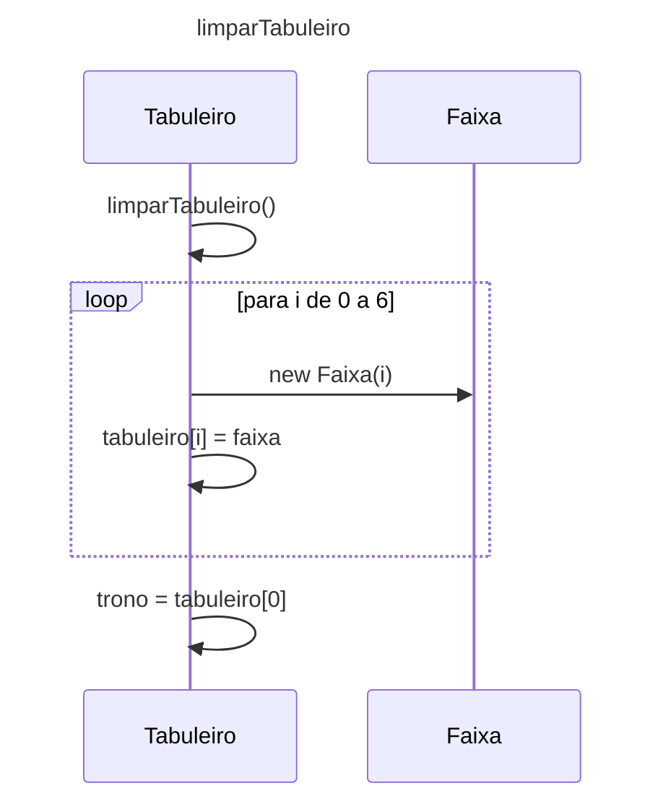

```mermaid
sequenceDiagram
    title limparTabuleiro
    participant Tabuleiro
    Tabuleiro->>Tabuleiro: limparTabuleiro()
    loop para i de 0 a 6
        Tabuleiro->>Faixa: new Faixa(i)
        Tabuleiro->>Tabuleiro: tabuleiro[i] = faixa
    end
    Tabuleiro->>Tabuleiro: trono = tabuleiro[0]
```