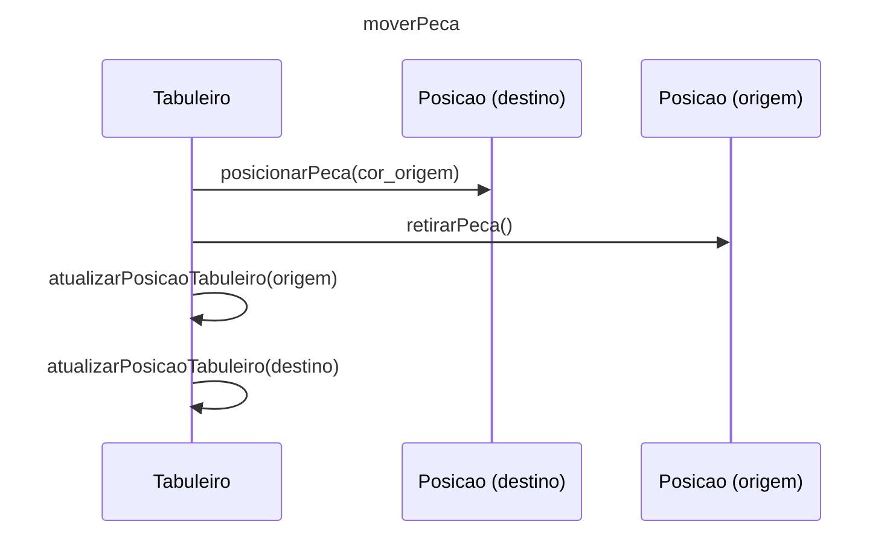

```mermaid
sequenceDiagram
    title moverPeca
    participant Tabuleiro
    Tabuleiro->>Posicao (destino): posicionarPeca(cor_origem)
    Tabuleiro->>Posicao (origem): retirarPeca()
    Tabuleiro->>Tabuleiro: atualizarPosicaoTabuleiro(origem)
    Tabuleiro->>Tabuleiro: atualizarPosicaoTabuleiro(destino)
```